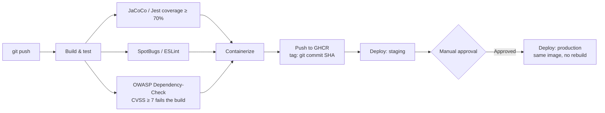

# diecocan-tools

Day-to-day administration tools. Spring Boot backend + React frontend, currently featuring an Owners management page (list, filter, create, edit, delete) backed by an H2 database.


## Tech stack

- **Backend**: Java 17, Spring Boot 4.1.0, Spring Data JPA, H2 (file-based, local dev database)
- **Frontend**: React 19, Webpack 5 (no Create React App), `react-router-dom`, `axios`
- **Tooling**: ESLint (flat config), JUnit 5 + Mockito, Jest + React Testing Library
- **CI/CD**: Jenkins (self-hosted, Docker) — see [CI/CD Pipeline](#cicd-pipeline) below

## Prerequisites

- Java 17+
- Maven
- Node.js (developed and tested with v23) and npm

## Setup & running

### Backend

```bash
mvn spring-boot:run
```

Runs on `http://localhost:8080`. The H2 database file lives at `./data/diecocan-tools-db` (created automatically on first run, gitignored).

### Frontend

```bash
cd frontend
npm install     # first time only
npm start
```

Runs on `http://localhost:3000`. Requests to `/v1/owners` are proxied to the backend on port 8080 in development (see `frontend/webpack.config.js`).

Other frontend scripts:
```bash
npm run build      # production bundle
npm run lint        # ESLint check
npm run lint:fix    # ESLint check, auto-fix what's safe
```

## Configuration

- **H2 console**: `http://localhost:8080/h2-console` — JDBC URL `jdbc:h2:file:./data/diecocan-tools-db`, username `sa`, password `password` (local dev only).
- **API base path**: `/v1/owners`, set in `frontend/src/constants/constants.js` and `OwnerController.java`'s `@RequestMapping`.

## API overview

| Method | Path | Description |
|---|---|---|
| GET | `/v1/owners` | List all owners |
| GET | `/v1/owners/{id}` | Get a single owner |
| POST | `/v1/owners` | Create an owner |
| PUT | `/v1/owners/{id}` | Update an owner |
| DELETE | `/v1/owners/{id}` | Delete an owner |

## Testing

- **Backend**: JUnit 5 + Mockito. `OwnerServiceImpTest` (pure unit tests, mocked repository) and `OwnerControllerTest` (`@WebMvcTest` slice tests, mocked service) — 12 tests covering all CRUD endpoints, including the 404 exception-handling path. Run with `mvn test`.
- **Frontend**: Jest + React Testing Library. `Navbar.test.jsx` and `OwnersTable.test.jsx` — 8 tests, `axios` fully mocked, covering fetch/filter/add/edit/delete. Run with `npm test`.

## CI/CD Pipeline

Two independent, self-hosted Jenkins pipelines (Docker), one per deployable component — each takes a commit all the way from build through production. Both pipelines call into [`fraud-pipeline-lib`](https://github.com/diecocan/fraud-pipeline-lib), a shared Jenkins library holding the build/test/containerize/deploy steps common to this project's Jenkinsfiles and `fraud-detection-kafka`'s four (`mavenBuildAndTest`, `nodeBuildAndTest`, `dockerBuildAndPush`, `deployContainer`, `verifyHttp`, `approvalGate`, etc.) — extracted once six near-identical Jenkinsfiles had converged on the same shape:



**Backend** (`Jenkinsfile`):
- Build/test: Maven, JUnit 5, inside a `maven` Docker agent
- Quality gates, all enforced in `mvn verify`:
  - **JaCoCo** — ≥70% instruction coverage
  - **SpotBugs** — static analysis for real bug patterns (not style), Medium threshold
  - **OWASP Dependency-Check** — fails on any dependency CVE with CVSS ≥ 7
- Multi-stage `Dockerfile` (Maven build → `eclipse-temurin` JRE runtime) → pushed to GHCR, tagged with the git commit SHA

**Frontend** (`frontend/Jenkinsfile`) — a separate Jenkins job:
- Build/test: `npm ci` (reproducible, exact installs), ESLint, Jest + React Testing Library
- Quality gates: lint errors fail the build; Jest coverage threshold ≥70%
- Multi-stage `Dockerfile` (Node build → `nginx` runtime), with an `envsubst`-templated nginx config that reverse-proxies `/v1/*` to the backend — the *same* image runs in every environment, only `BACKEND_HOST`/`BACKEND_PORT` differ at container start

**Images**: [ghcr.io — diecocan's packages](https://github.com/diecocan?tab=packages), tagged by git commit SHA (never `latest`) — the tag *is* the traceability link from a running container back to the exact commit that built it.

**Deploy targets** (local Docker containers on the pipeline host):

| Component | Staging | Production |
|---|---|---|
| Backend | `:8090` | `:8091` |
| Frontend | `:8092` | `:8093` |

A manual approval gate sits between staging and production in both pipelines — production always runs the *exact* image already verified in staging, never a rebuild. Rollback follows the same principle: redeploy an older known-good tag, no rebuild required.

> **Design note:** the original plan targeted Fly.io for staging/production. Fly requires a credit card on file even for free-tier usage; rather than add one, the deploy target was switched to local Docker containers on the same host. Everything upstream of deployment — build, gates, containerization, registry push — is completely unaffected by that choice.

## Roadmap

- Add loading/error/empty states to the Owners table (currently only `console.error`s on failure)
- Add client-side validation beyond the `required` attribute on the name field
